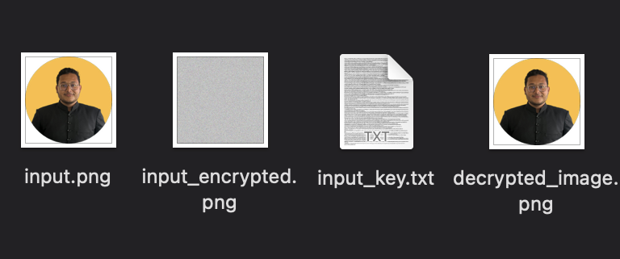

# Image Encryption and Decryption CLI Tool
<p align="center">
  
</p>
## Overview

This command-line tool allows you to encrypt and decrypt images using a simple and intuitive interface. It provides functionalities to encrypt an image with a randomly generated key and decrypt it back to its original state using the same key.

## Features

- **Encryption**: Encrypts an image file using a randomly generated key.
- **Decryption**: Decrypts an encrypted image file using the corresponding key.
- **Custom Output Names**: Allows specifying custom output filenames for the encrypted and decrypted images.
- **Validation**: Validates input parameters to ensure a smooth encryption/decryption process.
- **Interactive**: Provides interactive prompts to guide users through the encryption/decryption process.

## Usage

To use the tool, follow these steps:

1. **Encryption**:
```node
node index.js --encrypt <image_file_path> [--outputImageFileName <output_image_file_name>] [--outputKeyFileName <output_key_file_name>] [--clear]
```

Example:
```node
node index.js --encrypt image.jpg --outputImageFileName encrypted_image.jpg
```

2. **Decryption**:
```node
node index.js --decrypt <encrypted_image_file_path> --key <key_file_path> [--outputImageFileName <output_image_file_name>] [--clear]
```

Example:
```node
node index.js --decrypt encrypted_image.jpg --key encryption_key.txt
```

Note: Replace `<image_file_path>`, `<encrypted_image_file_path>`, `<key_file_path>`, `<output_image_file_name>`, and `<output_key_file_name>` with the appropriate file paths and filenames.

## Installation

1. Clone the repository:
```git
git clone https://github.com/AngryFalcon89/Image-Encryption-and-Decryption-CLI-Tool.git
```

3. Install dependencies:
```node
npm i
```

## Dependencies

- `cli-alerts`: ^2.2.0
- `jimp`: ^0.16.1

## Contributing

Contributions are welcome! Please feel free to submit issues and pull requests.

## License

This project is licensed under the MIT License - see the [LICENSE](LICENSE) file for details.

